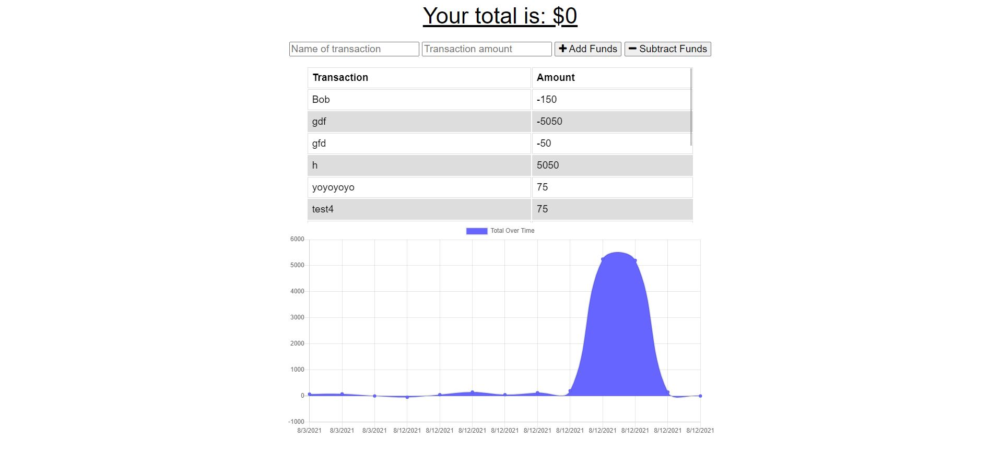

# Online-Offline-Budget-Tracker

## Description
This is an app that utilizes PWA technology to allow for both offline and online use. The app itself is used to track expenses where the user can add a transaction with the amount and whether or not it added money to the budget or took money away from the budget.

 

## Images

**Above is an image of the webpage with several transactions entered. For reference, this screenshot was taken when the app was offline.**

 

## Installation and Operation
In order to run this app, the user must first clone the repo locally and then navigate into the cloned repo. Once in the cloned repo, run `npm install`. After the previous steps have been completed, then the server can be started using `node server.js`. From there the user can access the webpage by going into their browser of choice and navigate to `localhost:3000`. For simplicity, the user can also access a fully working version of this app through the deployment link below.

 

## Deployment Link
https://whispering-brook-07684.herokuapp.com/